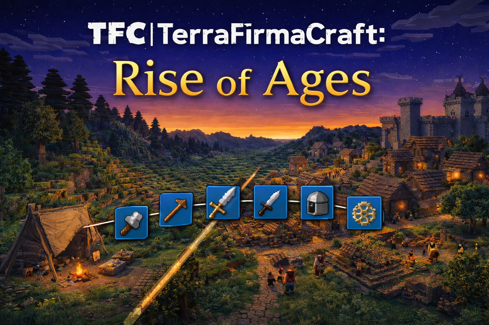

# TerraFirmaCraft: Rise of Ages

<p>
  
</p>


A modular progression framework for TerraFirmaCraft-focused gameplay.

---

## 🚀 Overview

**Rise of Ages** is a progression system for TerraFirmaCraft built around three connected layers:

- **scientific and technical development** through institution progress
- **social development** through era progression
- **player specialization** through profession point investment

The project is designed as a modular architecture so that progression rules can stay decoupled from Minecraft-specific integration.

---

## 🧱 Architecture

```text
core domain
├── Subjects            → SubjectRef, SubjectType
├── Institutions        → InstitutionDefinition, InstitutionState, InstitutionRegistry
├── Professions         → ProfessionDefinition, ProfessionState, ProfessionRegistry
├── Eras                → EraDefinition, EraState, EraRegistry
└── Progress            → ProgressEvent, SubjectProgressData

mod integration
├── Persistence         → ProgressRepository, SavedDataProgressRepository, CoreSavedData
├── Services            → ProgressService, ProfessionService, SubjectService, EraService
├── Bootstrap           → CoreBootstrap, CoreServices
└── Commands / UI       → debug commands, future screens and sync
```

---

## 📦 Current Systems

### Subjects
A **subject** is any entity that can own progression data.

Planned subject types:
- player
- group
- settlement

Current implementation is focused on players.

### Institutions
Institutions represent long-term development branches of society.

Current default registry:
- extraction
- metallurgy
- smithing
- agriculture
- animal husbandry
- foodcraft
- crafts
- construction
- engineering

Institutions are used as the main signal for **era progression**.

### Professions
Professions represent **player specialization**.

Current design:
- all profession tracks are visible to the player
- the player earns **mod-specific profession XP** in different tracks
- profession points are invested manually after enough XP is accumulated
- the player has a **global point cap** and must choose between specialization and generalization

This makes professions a player-facing build system rather than a passive stat line.

### Eras
Eras represent the current development stage of the subject or society.

They are resolved from broader progression state rather than selected manually in normal gameplay.

---

## 📁 Project Structure

```text
root
├── src-core/
│   └── main/java/com/rapitor3/riseofages/core/
├── src-mod/
│   └── main/java/com/rapitor3/riseofages/
├── docs/
└── README.md
```

---

## ⚙️ Running the Project

```bash
gradlew.bat runClient
```

---

## 🔁 Progression Flow

### Institution Progress Example

```java
SubjectRef subjectRef = subjectService.resolve(player);

ProgressEvent event = ProgressEvent.now(
        player.getUUID(),
        subjectRef,
        InstitutionKey.of("smithing"),
        ActivityType.SMITHING,
        5.0D,
        "tfc_anvil"
);

progressService.record(level, event);
```

### Profession Progress Example

```java
SubjectRef subjectRef = subjectService.resolve(player);

professionService.addExperience(
        level,
        subjectRef,
        ProfessionKey.of("smithing"),
        100
);

if (professionService.canInvestPoint(level, subjectRef, ProfessionKey.of("smithing"))) {
    professionService.investPoint(level, subjectRef, ProfessionKey.of("smithing"));
}
```

---

## 🧠 Core Concepts

### Subject
The owner of progression data.

### Institution
A long-term societal development branch.

### Profession
A player specialization track driven by XP and point investment.

### Era
A broader stage of development derived from progression state.

### ProgressEvent
An atomic progression record used to feed institution progression.

---

## 🛠 Debug Commands

Current debug tooling includes profession commands for testing without GUI:

```text
/roa debug profession addxp <profession> <amount>
/roa debug profession invest <profession>
/roa debug profession info
```

These commands are intended for balancing and iteration while the gameplay hooks and GUI are still in development.

---

## 📚 Design Principles

- separation of domain and Minecraft integration
- data-driven registries where possible
- explicit service layer for gameplay operations
- persistence behind repository abstractions
- progression systems that can be extended later with GUI, sync, and balancing

---

## 📌 Development Status

Current:
- core progression system implemented
- institution registry and era calculation wired
- profession registry, state, and titles added
- profession service and progression rules added
- profession debug commands available
- saved-data-backed persistence in place

Next:
- profession content and bonuses
- gameplay hooks for profession XP gain
- GUI for institutions and professions
- balancing and progression pacing
- networking and client sync

---

## 📄 License

This project is licensed under the MIT License.
